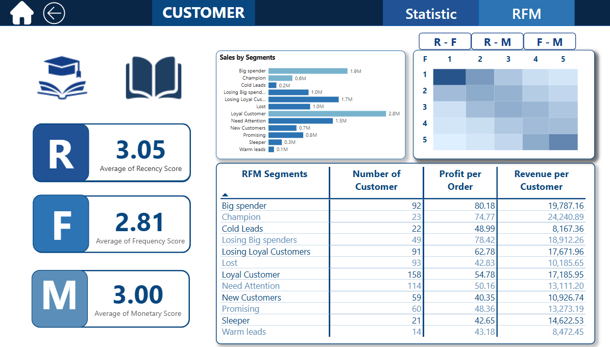
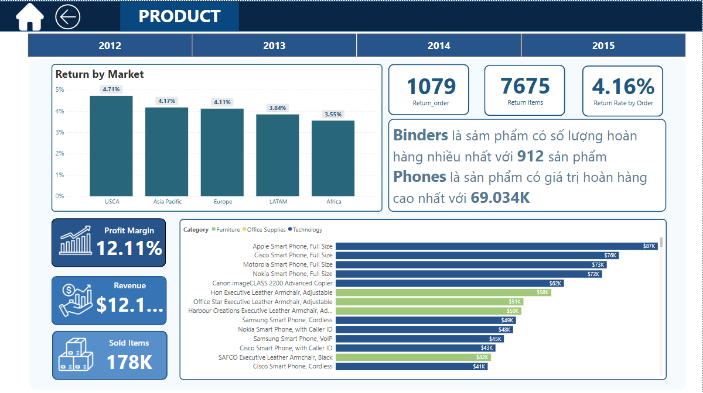

# Global Superstore Sales Analysis

Dự án này thực hiện phân tích dữ liệu bán hàng từ bộ dữ liệu **Global Superstore**, bao gồm thông tin về đơn hàng, khách hàng, sản phẩm và lợi nhuận trên nhiều khu vực thị trường khác nhau từ 2012-2015

## Giới thiệu bộ dữ liệu

Bộ dữ liệu chứa hơn 10,000 giao dịch, bao gồm:
- Thông tin đơn hàng: ngày đặt hàng, giao hàng, quốc gia, thành phố, khu vực
- Khách hàng: mã khách, tên, phân khúc, quốc gia
- Sản phẩm: tên, danh mục, phân loại
- Tài chính: doanh số (Sales), chiết khấu (Discount), lợi nhuận (Profit), chi phí vận chuyển (Shipping Cost)

---

## Dashboard Tổng quan

- Tổng doanh thu, số lượng đơn hàng, khách hàng
- Tăng trưởng lợi nhuận theo tháng (YoY %)
- Top sản phẩm lợi nhuận cao và sản phẩm hoàn trả nhiều nhất

---

## Phân tích Khách hàng (RFM Segmentation)

- Phân loại khách hàng dựa trên RFM: Recency, Frequency, Monetary
- Các nhóm như: Big Spender, Loyal Customer, Lost, Champion
- Hiển thị trung bình điểm RFM và phân phối theo phân khúc

---

## Phân tích Sản phẩm & Tỷ lệ hoàn trả

- Tỷ lệ hoàn trả theo thị trường (Return by Market)
- Top sản phẩm có số lượng và giá trị hoàn trả cao
- Lợi nhuận biên (Profit Margin) và số lượng sản phẩm bán ra

---

## Công cụ sử dụng

- Power BI cho trực quan hóa
- M code cho Power Query phân loại khách hàng
- DAX measure,....

---

> Dự án thực hành trực quan trong môn học Bussiness Intelligence

